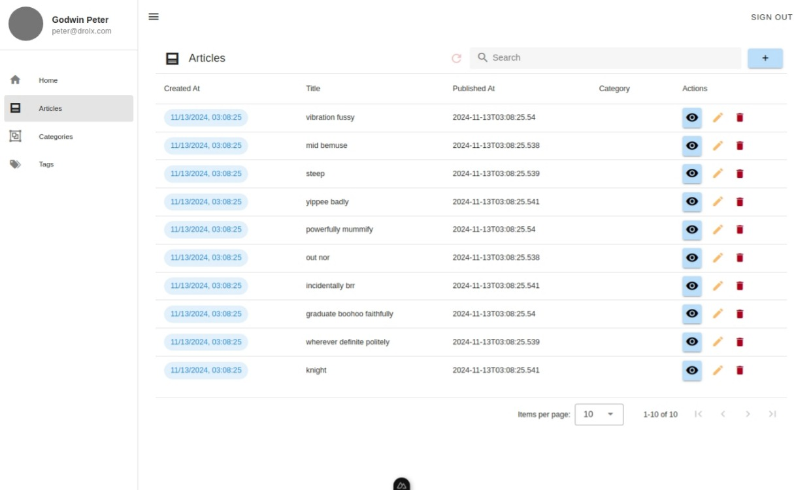

# Ying - Supabase + Drizzle Experiments

An experimental project for exploring the effectiveness and stability of extensively using supabase which is a self-hosted backend as a service (BaaS)  with nuxt and typescript exploring various fators like ease of generating migrations, applying the migrations, creating or define RLS role permission and seeding said database all while using an ORM to allow for seamless development that matches with the end goal which users will interact with.

## Tecnology Stack
- Nuxt
- Supabase + All additions
- Drizzle
- Postgres
- Vuetify

### Example for view and filtering data

### Example for creating / modify data

### Example for authentication

---

## Licenses

drolx Labs 2024 - Present.

[MIT](./LICENSE.md)
